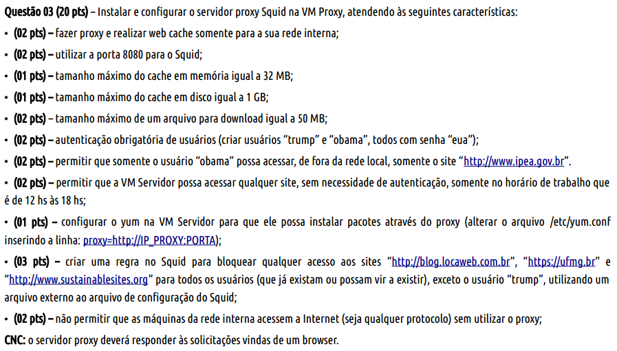
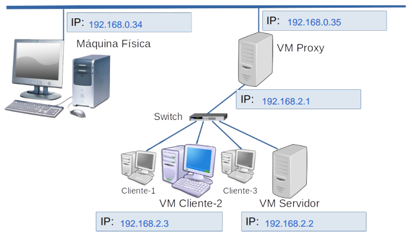
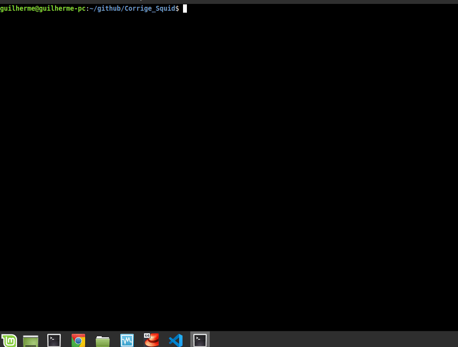

# Corrige Squid

Programa desenvolvido em Shell Script para realizar a correção das configurações realizadas no Proxy Squid. Trabalho desenvolvido para a disciplina de Administração e Gerência de Redes de Computadores.

## Objetivo

O objetivo do script é corrigir remotamente algumas das seguintes questões do exercício abaixo. É preciso verificar se as configurações exigidas no exercício foram aplicadas corretamente nos servidores.

<p align="center">

</p>

O exercício segue a topologia abaixo. Para a correção o script deve ser executado a partir da máquina física, e então o será realizado o SSH nas máquinas VM Proxy e VM Servidor.

<p align="center">

</p>

## Funcionamento
Para realizar a correção foi criado o arquivo de configurações `corrige_squid.conf`, onde o usuário do programa pode configurar os ip's das máquinas e também a pontuação para cada parâmetro do Squid realizado corretamente. 

Portanto, neste aquivo de configurações foram inseridas os ip's das máquinas  VM Proxy e VM Servidor, 192.168.0.35 e 192.168.2.2 respectivamente, e também as senhas dos usuários de cada máquina, para realizar o acesso.

```bash
GLOBAL_CONFIG {
    host_proxy_externo 192.168.0.35
    host_proxy_interno 192.168.2.1
    root_password admin
 	ssh_port 22
}

YUM_PROXY {
    pontos (2 pts)
	host 192.168.2.2
	root_password 123456
}

...
```

Após realizar as configurações no arquivo `corrige_squid.conf` é preciso executar o `setup.sh`, a partir da máquina física, assim o script irá realizar o SSH nas máquinas necessárias e corrigir os parâmetros do Squid.
<p align="center">

</p>